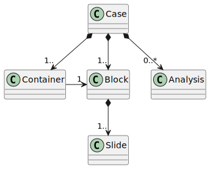

# Domain Description: Pathology

Pathology literally means the _study of diseases_.
It is commonly divided into the following sub-disciplines:

- **Autopsy**: The study of human corpses (which can further be distinguished into a _forensic_ and a _clinical_ branch).
- **Histology**: The study of tissue specimen.
- **Cytology**: The study of cell specimen.
- **Molecular Pathology**: The study of diseases on the molecular leve (e.g. DNA and RNA).

The focus of this data model and its main application area is centred around histology and cytology, as these
stand for most of the workload in the modern pathology laboratory.

## Domain model

The core _entity_ is a `Case`, i.e. a specimen (or several related specimens) taken from a patient and sent into 
the laboratory for further diagnosis together with its metadata.
The case arrives in one or more `Container`s. 
Inside, the lab the specimen may get "unpacked" into several cassettes or `Block`s.
From each block, one or more (tissue/cell) `Slide`s get created, which are then assessed by the pathologists (traditionally by using a microscope, but with _digital pathology_ the slides are scanned on a very high resolution). 
Additionally, specialized `Analysis` (e.g., DNA sequencing, in-situ hybridization, etc.) may be performed on the specimen.
Finally, a `Report` is created, which gets sent back to the requesting clinician or GP.
The following, figure summarizes a simplified view of this initial data model.

<figure style="display: flex; align-items: center; flex-direction: column">
    
    <figcaption style="font-size: 1.2rem; font-style: italic; color: #999" >Fig 1: Pathology Domain Model: First Iteration</figcaption>
</figure>

## Process Model

The process inside the laboratory can be described with a process model. 
In our investigations, _petri nets_ turned out to be a very fitting process modeling technique to capture this laboratory workflow.
