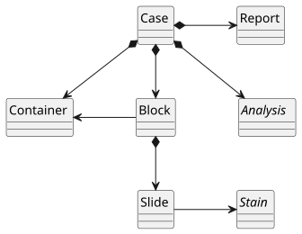
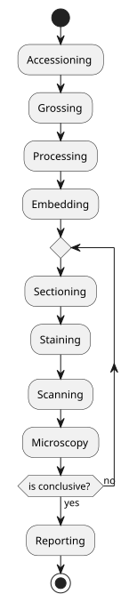

# Domain Description: Pathology

Pathology literally means the _study of diseases_.
It is commonly divided into the following sub-disciplines:

- **Autopsy**: The study of human corpses (which can further be distinguished into a _forensic_ and a _clinical_ branch).
- **Histology**: The study of tissue specimen.
- **Cytology**: The study of cell specimen.
- **Molecular Pathology**: The study of diseases on the molecular leve (e.g. DNA and RNA).

The focus of this data model and its main application area is centred around histology and cytology, as these
stand for most of the workload in the modern pathology laboratory.

## Domain model

The core _entity_ is a `Case`, i.e. a specimen (or several related specimens) taken from a patient and sent into 
the laboratory for further diagnosis together with its metadata.
The case arrives in one or more `Container`s. 
Inside, the lab the specimen may get "unpacked" into several cassettes or `Block`s.
From each block, one or more (tissue/cell) `Slide`s get created, which are then assessed by the pathologists (traditionally by using a microscope, but with _digital pathology_ the slides are scanned on a very high resolution). 
Additionally, specialized `Analysis` (e.g., DNA sequencing, in-situ hybridization, etc.) may be performed on the specimen.
Finally, a `Report` is created, which gets sent back to the requesting clinician or GP.
The following, figure summarizes a simplified view of this initial data model.

<figure style="display: flex; align-items: center; flex-direction: column">
    
    <figcaption style="font-size: 1.2rem; font-style: italic; color: #999" ><strong>Fig 1:</strong> Pathology Domain Model: First Iteration</figcaption>
</figure>

## Process Model

## Histology

Histology, i.e. the analysis of human tissues stands for the gross share of all activities within the laboratory 
since it involves several activities with manual human labor.
A simplified depiction of this process is shown in Fig 2.

<figure style="display: flex; align-items: center; flex-direction: column">
    
    <figcaption style="font-size: 1.2rem; font-style: italic; color: #999" >Fig 2: Histology Process</figcaption>
</figure>

- When a specimen arrives at the pathology laboratory, it is first assigned
to a case (_“Accessioning”_), i.e. various metadata (patient data, information about the sample
type, clinical inquiries) are aggregated in the LIS, a priority is
assigned, and the specimens are labelled with a lab-internal identifier. In most modern labs, this
identifier has the form of an industrial barcode, which leverages electronic tracing throughout
the process
- When the specimen has been immersed in a fixative solution (e.g., formalin) for
a sufficient amount of time, it can be delivered to the next stage of the process: _“Grossing”_.
Here, the tissue is examined on a macroscopic level (i.e., “with the naked eye”) for abnormal
findings and marked. In case of larger specimens, slices with findings of interest are selected
from the specimen.
- Tissues are placed in a cassette and delivered to _“Processing”_. This step is
performed by a specialized machine that automates dehydration, clearing and infiltration of
the tissue with paraffin wax.
- Afterwards, the processed tissue is taken to _“Embedding”_. This
means that it is placed in molten paraffin wax to form a `block`. 
- The cooled-down
paraffin block is mounted on a Microtome, which allows cutting very thin slices (∼ 3-4𝜇𝑚) from
the tissue-paraffin-block (_"Sectioning"_). 
- The slices are placed on a glass slide and delivered to the “Staining”
process step. Here, the slide is put through different chemicals, which amplify contrasts and
highlight certain biological structures, e.g. hematoxylin stains cell nuclei blue and eosin stains
cell bodies (cytoplasm) red. Finally, a protective cover-slip is mounted on top of the stained
tissue slice forming the `slide`.
- With the advent of ditial pathology, the stained slides are now _scanned_ with microscopic resolution. 
- Thus, in what follows (_"Microscopy"_), the pathologist assesses all the slides of the case to write a diagnostic report.
In some cases, it is necessary to order additional stained slides (e.g. using "immunohistochemistry (IHC)"). In that case,
lab technicians retrieve the respective block, create another section, create a new slide.
- Eventually, the pathologist answers the report with a conclusive diagnosis.

