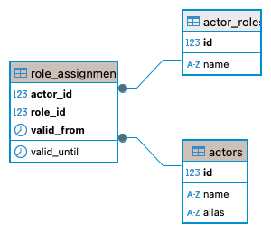
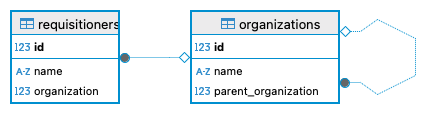
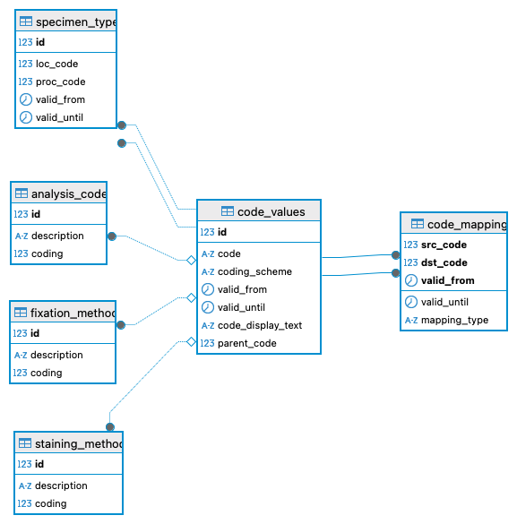

# Masterdata Schema

The purpose of this schema is host tables, which contain data that can be considered configuration-/metadata,
which can be subject to changes. In database admin vernacular this is often referred to as _master-data_.
An example is a table containing all `requisitioners`, who are sending their specimens to your lab.


## Actors and Roles

When analyzing a process, the _human "resources"_ generally play an important role.
We are calling, everyone that is involved in (manually) executing an activity or triggering an event, an _actor_[^actor].
Thus, there is a table of all `actors` and table capturing what `roles` these actors had at different points in time.

[^actor]: The may be also non-human actors.




```sql
CREATE TABLE IF NOT EXISTS master.actors (
	id int4 NOT NULL,
	"name" text NOT NULL,
	alias text NULL,
	CONSTRAINT actors_pkey PRIMARY KEY (id),
	CONSTRAINT actors_name_key UNIQUE (name)
);

CREATE TABLE IF NOT EXISTS master.role_assignments (
	actor_id int4 NOT NULL,
	role_id int4 NOT NULL,
	valid_from timestamptz NOT NULL,
	valid_until timestamptz NULL,
	CONSTRAINT role_assignments_pkey PRIMARY KEY (actor_id, role_id, valid_from),
	CONSTRAINT role_assignments_actor_id_fkey FOREIGN KEY (actor_id) REFERENCES master.actors(id),
	CONSTRAINT role_assignments_role_id_fkey FOREIGN KEY (role_id) REFERENCES config.actor_roles(id)
);
```


## Requisitioners and Organizations

Requisitioners are those sending in specimen to the laboratory. 
Often, there are multiple requisitioners that are working at the same organization and the organization may be comprised of different units. 
This is captured by the `requisitioners` and `organizations` tables.



```sql
CREATE TABLE IF NOT EXISTS master.organizations(
    id int4 NOT NULL,
    "name" text NOT NULL,
    parent_organization int4 NULL,
    CONSTRAINT organization_pkey PRIMARY KEY (id),
    CONSTRAINT organizartion_uniq UNIQUE ("name")
);
ALTER TABLE master.organizations ADD CONSTRAINT organization_parent_fkey FOREIGN KEY (parent_organization) REFERENCES master.organizations(id);

CREATE TABLE IF NOT EXISTS master.requisitioners (
	id int4 NOT NULL,
	"name" text NOT NULL,
	organization int4 NULL,
	CONSTRAINT requisitioners_name_key UNIQUE ("name"),
	CONSTRAINT requisitioners_pkey PRIMARY KEY (id),
	CONSTRAINT requisitioner_organization_fkey FOREIGN KEY (organization) REFERENCES master.organizations(id)
);

```


## Workstations 

Events may be associated with a _workstation_, i.e. where they have taken place. 
Additionally, the workstation may be linked to a lab location.

```sql
CREATE TABLE  master.workstations (
	id int4 NOT NULL,
	"name" text NOT NULL,
	workstation_desc text NULL,
	lab_location int4 NULL,
	CONSTRAINT workstations_name_key UNIQUE (name),
	CONSTRAINT workstations_pkey PRIMARY KEY (id),
	CONSTRAINT workstations_fk_lab_location FOREIGN KEY (lab_location) REFERENCES config.lab_locations(id);
);
```

## Codes and Analyis Catalogue 

_Coding_ is central activity in the medical disciplines.
It resembles the _modelling_ activity within computer science / software engineering.
The idea is to create common semantic understanding of similar concepts.
In general, they appear as classification schemes that describes different types of diseases (e.g. ICD-11), biological measurements (LOINC), or simply the majority of all clinical knowledge (SNOMED-CT). 
When several medical professionals agree on a coding scheme, semantic interopability becomes tangible as they 
now can make sure that they interpret the same information item in the same way.
The main issue with the existing coding schemes is that 
1. there are many of them, and 
2. they tend to change regularly


This data model aims to support the practice of medical coding as the backbone to later code different types 
of specimens, tissue stainining methods, or other analytical diagnostic methods.
There is a central `code` table, which contains all the codes in a coding scheme. 
Codes have a technical _validity_, may be hierarchical organized, and can be related by mappings.
The different type of code mappings are kept completely opaque and therefore up to the user to define.


The codes are then used to define a catalogue of 
- known specimen types
- known staining methods
- known analysis methods (i.e. which are not considered stains -> not related to a tissue slide).



## Worklow and Accounting Profiles


Finally, cases may be tagged with a _workflow_ and/or _accounting_ profile. 
This, is useful for later reporting where one may be interested in distinguishing differnt types of cases (e.g. 
a regular histopathology workflow vs. one where the laboratory serves as a consultant for an already prepared cased).


