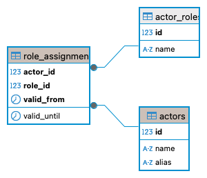
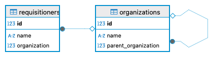
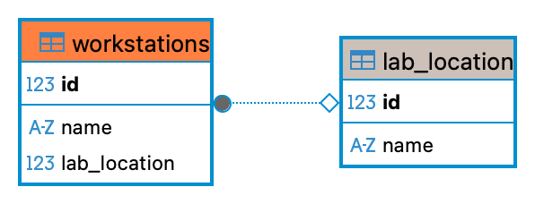
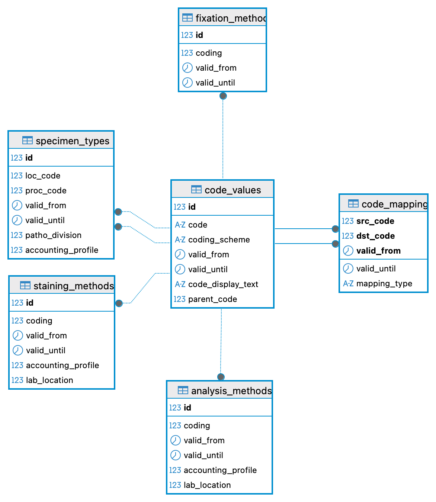

# Masterdata Schema

The purpose of this schema is to contain tables, which contain data that is considered configuration-/metadata.
The main distinction towards the tables in the `config` schema is that the contents of `master` tables 
may be subject to change.
Also, we are not providing sensible defaults for these tables, instead only provide examples of
how you may fill them.
Hence, you have to define the contents of these tables yourself, and you set up workflows
for administering the contents of these tables, for instance, introducing novel staining methods or 
obsoleting retired ones.
In database-admin vernacular this is often referred to as _master-data_.

Most of the tables in this schema have `sequences` associated with them (to create technical ids)
and also they contain `valid_from` and `valid_until` fields. 
Their purpose being _technical versioning_ to account for different masterdata entries 
that were valid at certain points in time. 
The `valid_from` should always be a valid point in time, whereas the `valid_until` may be empty (`NULL`).
In the latter case, the upper bound of the validity interval  is unound and the entry is valid indefinetely.

## Accounting Profiles 

Many laboratories need to create reports concerning the _"economic performance"_ of their laboratory.
To this end, there is the `accounting_profiles`, which can be used to register accounting categories.
A common use case is that specimen types have a certain cost, which might be re-imbursed in 
public healthcare system. Also, specific analyses may have different costs associated with them.
fall into a specific reimbursement category. 

The schema defines two optional fields: `level` and `amount`.
You are free to use these fields or not. 
The `amount` field may be used to enter a concrete monetary amount.
Alternatively/additionally, the `level` field may be used to impose a more _qualitative_ ordering of the accounting categories.


```sql
{{#include ../../schema/migrations/0200_master.up.sql:accounting_profiles}}

```

## Actors and Roles

<figure width="40%" style="display: flex; align-items: center; flex-direction: column">

<figcaption style="font-size: 1.2rem; font-style: italic; color: #999"><strong>Fig 2.1:</strong> <code>master.actors</code> context</figcaption>
</figure>

When analyzing a process, the _human "resources"_ generally play an important role.
We are calling, everyone that is involved in (manually) executing an activity or triggering an event, an _actor_[^actor].
Thus, there is a table of all `actors` and another table capturing what `roles` these actors had at different points in time.

[^actor]: The may be also non-human actors.


```sql
{{#include ../../schema/migrations/0200_master.up.sql:actors_roles}}
```


## Requisitioners and Organizations

<figure width="40%" style="display: flex; align-items: center; flex-direction: column">

<figcaption style="font-size: 1.2rem; font-style: italic; color: #999"><strong>Fig 2.2:</strong> <code>master.requisitioners</code> context</figcaption>
</figure>

Requisitioners are entities that send specimens to the laboratory. 
Often, there are multiple requisitioners that are working at the same organization and the organization may be comprised of different units. 
This is captured by the `requisitioners` and `organizations` tables.


```sql
{{#include ../../schema/migrations/0200_master.up.sql:requisitioners_organizations}}
```


## Workstations 

Events may be associated with a _workstation_, i.e. where they have taken place.
This could be a grossing bench, a sectioning station or simply a desktop computer.
The workstation can be linked to a lab location.

<figure width="40%" style="display: flex; align-items: center; flex-direction: column">

<figcaption style="font-size: 1.2rem; font-style: italic; color: #999"><strong>Fig 2.3:</strong> <code>master.workstations</code> context</figcaption>
</figure>

```sql
{{#include ../../schema/migrations/0200_master.up.sql:workstations}}
```

## Coding 

_Coding_ is a central activity in medical disciplines.
It resembles _modelling_ within computer science / software engineering.
The idea is to create a **common semantic understanding** of similar concepts.
There are classification schemes (taxonomies) that describes different types of diseases (e.g. [ICD-11](https://icd.who.int/en/)),
biological measurements (e.g. [LOINC](https://loinc.org/)), or complete ontologies that try to capture the
majority of all clinical knowledge (e.g. [SNOMED-CT](https://browser.ihtsdotools.org/)). 
With coding schemes, semantic interoperability becomes tangible as one 
now can make sure that everyone interprets the same information item in the same way.

However, the main issue with existing coding schemes is that ...
1. ... there are many of them, 
2. ... they may be way to comprehensive (too cumbersome) to work with,
3. ... they may lack necessary concepts, and/or
4. ... they tend to change regularly.

In UNPAIDME, we are trying to have a pragmatic approach towards these coding systems:
Concretely, we remain mostly agnostic w.r.t. the ontological dimension but we keep the idea 
of **unique identification**. To account for multiple coding systems, we allow to express 
_semantic mappings_ between concepts. The interpretation of these mappings (i.e. "parent/child", "equivalence", 
"replacement") is up to the user.


There is a central `code` table, which contains _codes_ in a coding _scheme_. 
The combination of a code and a scheme must be globally unique but the same code may appear in 
multiple schemes. If two codes shall represent "the same" ontological concept, one may define 
an entry in `code_mapping` and set the `mapping_type` accordingly (e.g. "synonym", "identity", etc.).
Codes have a technical _validity_, may be hierarchical organized, and can be related by mappings.
Each code and mapping also has a technical _validity_ (`valid_from`/`valid_until`) to account for
changes in coding systems.
Code may have a hierarchical structure (expressed via the `parent_code`).

```sql
{{#include ../../schema/migrations/0200_master.up.sql:coding}}
```

<figure width="40%" style="display: flex; align-items: center; flex-direction: column">

<figcaption style="font-size: 1.2rem; font-style: italic; color: #999"><strong>Fig 2.4:</strong> <code>master.codes</code> context</figcaption>
</figure>


As shown in Fig 2.4, codes provide a foundation for defining the following concepts:
- `specimen_types`,
- `staining_methods`,
- `analyses_methods`,
- `fixation_metods`.


### Fixation Methods

When specimens of a case are sent to the lab, they are always inside a container filled with 
a specific `fixation_method`. Probably, the most common being _formalin_ but there are also others.
The type of fixation has an effect on how long it the specimen needs to remain in the container before it 
can be taken out for grossing. Also, it may have effect on how to handle the specimen the qualiy of the tissue.


```sql
{{#include ../../schema/migrations/0200_master.up.sql:fixation_methods}}
```

### Specimen Types 

Specimen types play a central role when it comes to creating 
simulation models of pathology processes because the specimen type affects the arrival rate of cases,
the number of blocks that are created during grossing, the intrinsic complexity during microscopic analysis and more.

In our model, a specimen type is defined by a combination of an (anatomical) _location_ (skin, lung, breast, etc.) and 
a (sampling) _procedure_ (biopsy, resection, etc.), where both location and procedure are identified by a code.

Specimen types may be assigned to one particular `patho_division` and may have an associated `accounting_profile`.

```sql
{{#include ../../schema/migrations/0200_master.up.sql:specimen_types}}
```

### Staining Methods 

Each tissue slide has a _stain_.
For example, in histology _Hematoxyling & Eosin (H&E)_ represents the predominant staining method.
We consider the term _stain_ to be abstract in the sense that 
also _immunohistochemistry (IHC)_ or _in-situ hybridization_ are considered as some form of "stain",
even though, they technically not produced via a "chemical staining procedure".

Staining methods may only be produced at a specific `lab_location` and may have a specific `accounting_profile` (both completely optional).
```sql
{{#include ../../schema/migrations/0200_master.up.sql:staining_methods}}
```

### Analysis Methods

The microscopic analysis of slides is the main diagnostic procedure in pathology.
However, there are auxiliary analysis methods such as for instance _flow cytometry_ or _molecular (DNA/RNA) analysis.
All "other" analysis methods that do not fit in the _staining method_ schema are considered analyses.
Each analysis method must be identified by a unique code and may have accounting profiles associated.

An Analysis method may only produced at a specific `lab_location` and may have a specific `accounting_profile` (both completely optional).
```sql
{{#include ../../schema/migrations/0200_master.up.sql:analysis_methods}}
```

### Implementation Guidelines 

The design decision to build specimen types, stains, and analyses types on the notion of a `code`
has a practical implication for the set-up of the masterdata table content.
Before one is able to set up specimen types or analysis types, one is required to define or import 
a coding system. 


One may ask, whether it is necessary to find a suitable ontology to host one's specimen types, staining methods, and 
analysis types before he or she may be able to use this database schema? 
The answer is of course: No! Even though, it is encouraged to have reliable coding systems, a pragmatic approach 
is to define a list/catalogue of specimen types, staining methods, etc., which is used in the concrete laboratory.
This catalogue then receives a non-global name, e.g. "`STAINING_METHODS`".
To illustrate this, we have included an example catalogue of common staining methods and also the official catalogue 
of specimen types for which there exist a refund category in the national reimbursement scheme.

We provide some example specimen and stain catalogs with their respective codings in the `data/examples/` directory:

- [`norpat_codes.csv`](../../data/examples/norpat_codes.csv) contains the ["Norsk patologikodeverk (NORPAT)](https://www.helsedirektoratet.no/digitalisering-og-e-helse/helsefaglige-kodeverk/norpat)
code system in the format expected by `master.code_values` (using `id`s 1 until 9959). This coding system, used by 
the Norwegian pathology association is based on the orignal "Systematized Nomenclature of Pathology (SNOP)" developed by the 
"College of American Pathologists" and provides a taxonomy for anatomical locations, procedures, morphological changes,
medical causation and diseases.
- [`apat_specimens.csv`](../../data/examples/apat_specimens.csv) contains a [curated catalog of specimen types](https://www.helfo.no/Sykehus-poliklinikk/regelverk-og-takster-for-sykehus-poliklinikk/regelverk-og-refusjon-for-sjukehus-og-poliklinikk/ny-refusjonsordning-for-poliklinisk-patologi),
defined by the Norwegian health directorate, which  are recognised to give reimbursements for the lab through the public health care funding.
The structure matches the format of the `master.specimen_types` table and the coding is based on the NORPAT system.
- [`snomedct_stain_codes.csv`](../../data/examples/snomedct_stain_codes.csv)/[`snomedct_stain_types.csv`](../../data/examples/snomedct_stain_types.csv)
contains a list of staining methods which are defined in [SNOMED CT](https://www.snomed.org/what-is-snomed-ct), i.e.
the _children_ of [`45389009 ` (Tissue stain)](https://browser.ihtsdotools.org/?perspective=full&conceptId1=45389009&edition=MAIN/) 
conforming to the structure of `master.code_values` and `master.staining_methods` respectively.

Feel free to use these for your installation or use them as an inspiration to define your own. 
We are convinced that the definition of a comprehensive coding and specimen catalog is valuable activity, which 
generally has to be done only once and pays off in the lon run.


Shell script to apply the example masterdata:
```bash
# Assuming the connection parameters are set 
psql << EOF
\COPY master.code_values FROM data/examples/norpat_codes.csv WITH DELIMITER ',' CSV HEADER
\COPY master.code_values FROM data/examples/snomedct_stain_codes WITH DELIMITER ',' CSV HEADER
\COPY master.specimen_types FROM data/examples/apat_specimens.csv WITH DELIMITER ',' CSV HEADER
\COPY master.staining_methods FROM data/examples/snomedct_stain_types WITH DELIMITER ',' CSV HEADER
ALTER SEQUENCE master.code_values_seq RESTART WITH 10201;
ALTER SEQUENCE master.specimen_types_seq RESTART WITH 1477;
ALTER SEQUENCE master.staining_methods_seq RESTART WITH 201;
EOF

```

