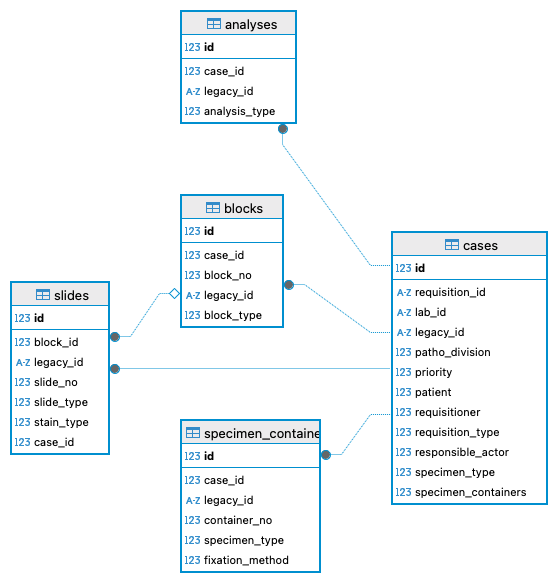
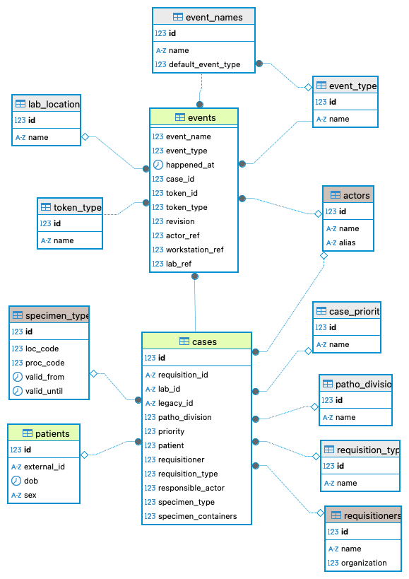

# Transactional Schema

Finally, the `trans` schema hosts all the tables containing _transactional_ data, i.e. `cases`, `blocks`, `slides`, ...,  and probably most importantly: the `events` happening on them!

## Entities

The heart of the `trans` schema reflects the initial idea of domain model in [Section](./chapter_1_1.md).

## Events 

Arguably, the most important table in the whole schema is the `events` table.
This table represents an event log, ideally capturing anything that happens within the laboratory.
This table will contain _a lot of entries_, hence, the implementation should make the necessary preparations, e.g. setting up partitioning (based on timestamps) to facilitate efficient queries[^timescale].

[^timescale]: One variant, the one we used previousl and the had good results with, is to use the PostgreSQL _Timesclae_ extension.

The contents of the events table are rather compressed and basically contain only timestamps and keys. 
One, may use a _snowlake_ organization to create queries that provide reports:

The events table has the following columns:

|Name|Type|Description|Reference|
|----|----|-----------|---------|
|event_name|int4|description of the event/activity|config.event_names|
|event_tupe|int4|indicator of whether event/actvity start/top|config.event_types|
|happened_at|timestamptz|when did the event occurs| |
|case_id|int8|reference to the case|trans.case|
|token_id|int8|reference to a token inside the case|trans.{case, specimen_container, blocks, slides,analyses}|
|revision|int4|a flag, which can be used to indicate data quality (optional)||
|actor_ref|int4|the actor that caused this event (optional)|master.actors|
|workstation_ref|int4|reference to the workstation where the event happend (optional)|master.workstations|
|lab_ref|int4|reference to the location where the event happened|config.lab_locations|
