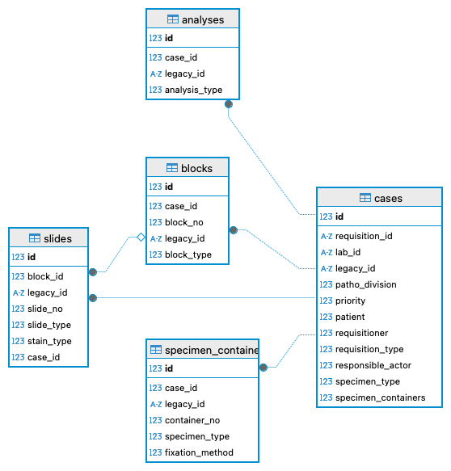
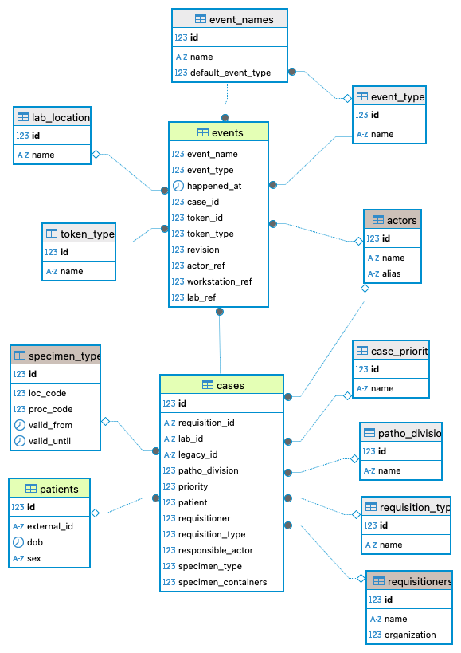

# Transactional Schema

Finally, the `trans` schema hosts all the tables containing _transactional_ data, i.e. `cases`, `blocks`, `slides`, ...,  and probably most importantly: the `events` happening on them!


## Entities

The heart of the `trans` schema reflects the initial idea of domain model in [Section](./chapter_1_1.md).




### Patients 

Each case has an associated patient. 
The primary purpose of this data model is the analysis of the pathology process itself.
Therefore, patients are not the primary focus.
They could be considered somewhere at the intersection between Masterdata and Transactional data. 
We have decided to put them into the `trans` schema simply because there are a lot more of them as there are requisitioners,
hence the table changes more often.
The notion of patient is useful since the fact, whether a case belongs to a patient that has been in contact with the lab previously
may have an affect on how the case will be handled.
Moreover, we added a flag `is_test` to this table to distinguish _"test patients"_, i.e. some laboratories have not-real
patients for testing purposes in their productive LIS.

```sql
{{#include ../../schema/migrations/0300_trans.up.sql:patients}}
```

### Cases 

Cases are the main entities that "flow" through the process. 
They further decompose into `specimen_containers`, `blocks`, `slides`, and `analyses`.
Each case can have multiple identifiers:
- `id`: This is the technical id from the UNPAIDME mode. It should be assigned via the `SEQUENCE` 
and thus different from the `id` inside the LIS.
- `requisition_id`: This is a mnemonic (real) id, which the requisitioner has asssigned. It could be easier for 
humans to remember (rather than the technical id inside a journal system) and is used for  lookup purposes.
- `lab_id`: This is the laboratory counterpart of the requisition id, i.e. a more easily remembered identifier that
is assigned by the laboratory (usually during acessioning).
- `legacy_id`: This is the technical id that the LIS uses (for correlating entries later)

```sql
{{#include ../../schema/migrations/0300_trans.up.sql:cases}}
```
 
### Specimen containers 

Specimen containers are the physical "boxes" or "glasses" that contain the specimens sent to the lab.


```sql
{{#include ../../schema/migrations/0300_trans.up.sql:specimen_containers}}
```

### Blocks 

During the grossing stage, the case "decomposes" into several `blocks`, each holding a small tissue part for further processing.
The blocks receive a technical UNPAIDME `id` and may retain (for correlation purposes) their original `legacy_id`, i.e.
the technical id used by the LIS.

 
```sql
{{#include ../../schema/migrations/0300_trans.up.sql:blocks}}
```

### Slides 

The "end-product" in the pathology process are `slides`, which contain thin stained tissue slides that can be analysed under the microscope.
Similarily to the other artifacts, the `slide` retains a `legacy_id`.
Moreover, the `slide` known about the respective stain (via a reference to the respective masterdata table).


```sql
{{#include ../../schema/migrations/0300_trans.up.sql:slides}}
```


### Analyses 

Parallel to the `blocks` and `slides`, the `case` may contain additional forms of `analyses`.


```sql
{{#include ../../schema/migrations/0300_trans.up.sql:analyses}}
```

## Events 

Arguably, the most important table in the whole schema is the `events` table.
This table represents an event log, ideally capturing anything that happens within the laboratory.
This table will contain _a lot of entries_, hence, the implementation should make the necessary preparations, e.g. setting up partitioning (based on timestamps) to facilitate efficient queries[^timescale].

[^timescale]: One variant, the one we used previousl and the had good results with, is to use the PostgreSQL _Timesclae_ extension.


The contents of the events table are rather compressed and basically contain only timestamps and keys. 
One, may use a _snowflake_ organization to create queries that provide reports:




The SQL definition of the `events` table looks as follows:


```sql
{{#include ../../schema/migrations/0300_trans.up.sql:events}}
```

and is futher detailed in the table below:

|Name|Type|Description|Reference|
|----|----|-----------|---------|
|event_name|`int4`|description of the [event/activity](./chapter_3_1.md)|`config.event_names`|
|event_tupe|`int4`|indicator of whether event or actvity (start/stop)|`config.event_types`|
|happened_at|`timestamptz`|when did the event occur?| |
|case_id|`int8`|reference to the case|trans.case|
|token_id|`int8`|reference to a "token" inside the case|`trans.{case, specimen_container, blocks, slides,analyses}`|
|revision|`int4`|a flag, which can be used to indicate data quality (optional)||
|actor_ref|`int4`|the actor that caused this event (optional)|`master.actors`|
|workstation_ref|`int4`|reference to the workstation where the event happend (optional)|`master.workstations`|
|lab_ref|`int4`|reference to the location where the event happened|`config.lab_locations`|
