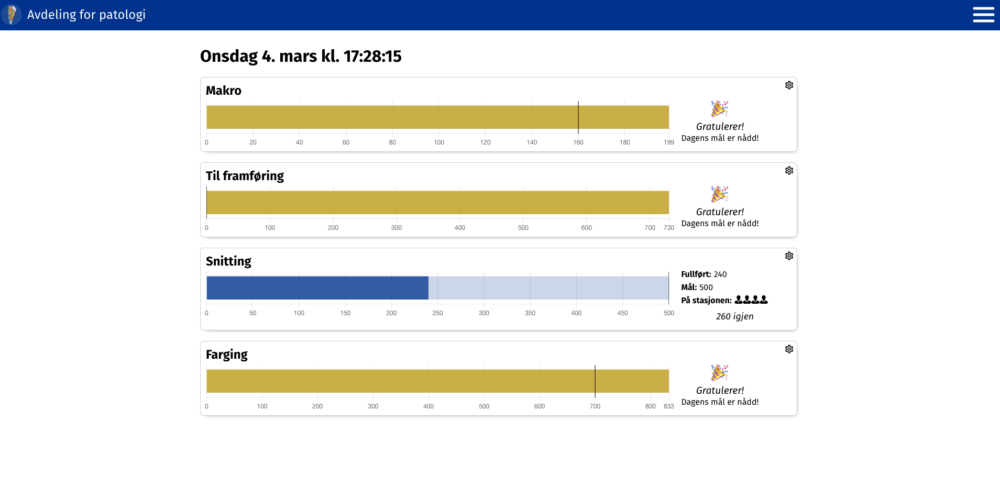
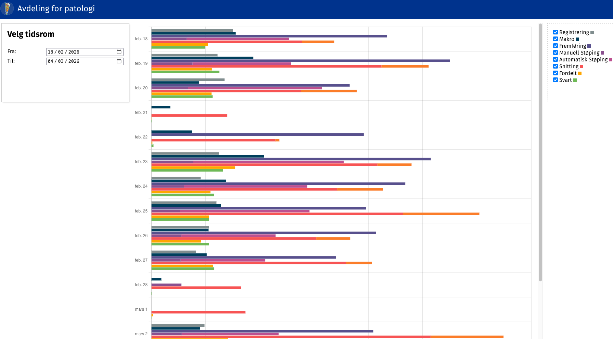

# Live and Production View

## LiveView

One of the first productive applications of the UNPAIDME data model is/was LiveView.
The latter originated from a Master thesis project and has since then been put into use in our laboratory at Haukeland University hospital in Bergen.

A screenshot the the solution is shown below:



Technically, _LiveView_ is just a simple JavaScript web application using [Chart.js](https://www.chartjs.org/)
based on a database view that aggregates the "production events" per station of the current day.

One way to define such view based on the UNPAIDME data model is shown in the following SQL snippet:

```sql
{{#include ../../schema/migrations/0500_reports.up.sql:live_view}}
```

The view aggregates events and the `live_view_config` defines what stations to be shown in the GUI and what the goals should be.


## Production View 

The current overview of grossed specimens, sectioned blocks or stained slides is definetely useful and works well as a _motivator_
(visuliazing the work that has been done), for planning purposes, a historic perspective is just as useful.
A possible visualization is shown below:




This perspective can be implemented using a view definition, which aggregates over much bigger time-span and shows the production per day.

```sql
{{#include ../../schema/migrations/0501_reports_production_timescale.sql}}
```

The SQL snippet shows how TimescaleDB's _continuous aggregates_ can be utilized to implement this view in a very effective manner.

